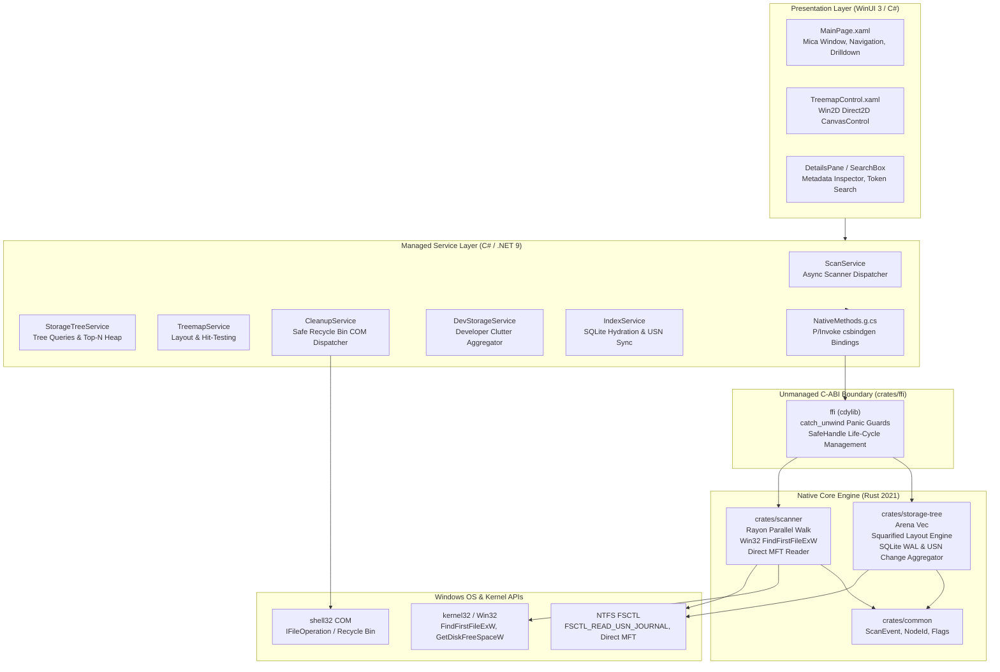

# SpaceOps Architecture Specification

SpaceOps is engineered as a high-performance, modular Windows storage intelligence tool. It decouples compute-heavy, latency-sensitive filesystem operations from modern Windows presentation layers via a zero-cost unmanaged C-ABI boundary.

---

## 1. High-Level System Layers



---

## 2. Core Subsystems

### A. High-Performance Filesystem Scanner (`crates/scanner`)
- **Parallel Traversal**: Spawns worker threads across CPU cores using `rayon::scope`.
- **Win32 Kernel Buffering**: Leverages `FindFirstFileExW` with `FindExInfoBasic` and `FIND_FIRST_EX_LARGE_FETCH` to maximize throughput on modern NVMe drives.
- **Physical Cluster Allocation**: Computes true on-disk footprint using `GetDiskFreeSpaceW` sector/cluster arithmetic (`round_up_to_cluster(len, cluster_size)`).
- **Reparse-Point Boundary Guard**: Detects junction points (`FILE_ATTRIBUTE_REPARSE_POINT`) and mounts, treating them as leaf nodes to prevent infinite directory recursion loops.
- **Throttled Progress Engine**: Aggregates processed files and bytes using atomic primitives (`AtomicU64`), streaming throttled progress notifications to the UI at 60 Hz without overwhelming the dispatcher.

### B. Compact In-Memory Arena (`crates/storage-tree`)
- **Flat Arena Representation**:
  ```rust
  pub struct StorageTree {
      pub(crate) nodes: Vec<TreeNode>,
      pub(crate) children: Vec<Vec<NodeId>>,
      pub(crate) root: usize,
  }
  ```
- **Cache Locality**: Nodes are stored in contiguous memory vectors indexed by a 64-bit `NodeId`, completely eliminating fragmented pointer graphs and reference-counting cycles.
- **Sub-Microsecond Lookups**: Direct $O(1)$ random access to any node or parent pointer.
- **Hierarchical Size & Count Bubbling**: Sizes bubble bottom-up during construction and incremental synchronization.
- **Top-N Heap Queries**: Uses binary min-heaps in native Rust to identify the largest files across millions of entries in $< 50\text{ ms}$.

### C. Direct2D Squarified Treemap (`crates/storage-tree` & `app/Controls`)
- **Bruls-Huizing-van Wijk Algorithm**: Implemented in native Rust (`treemap.rs`) to partition viewport rectangles while maintaining aspect ratios close to 1.0 (preventing thin, unreadable slivers).
- **Sub-Pixel Culling**: Tiles smaller than a configurable pixel threshold (e.g., 2.0 pixels) are dynamically pruned from the render list, preserving 120 FPS frame times.
- **Win2D Hardware Acceleration**: WinUI 3 draws rectangles via `Microsoft.Graphics.Win2D`'s `CanvasControl` with Direct2D hardware acceleration, instant hover hit-testing, and animated transitions.

### D. Zero-Accident Safe Cleanup Engine (`crates/storage-tree/src/cleanup.rs`)
- **Immutable Blacklist**: Enforces hardcoded protections against system-critical paths (`C:\Windows`, `C:\Program Files`, boot managers, registry hives).
- **Recycle Bin Routing**: Deletions are executed using Windows Shell COM interfaces (`IFileOperation`), ensuring files are moved to the user's Recycle Bin rather than permanently unlinked.
- **Dry-Run Validation**: Every cleanup action supports simulation mode returning exact byte reclamation projections before any file operation executes.

### E. Developer Clutter Attribution (`crates/storage-tree/src/developer.rs`)
- Detects build artifacts and package caches across 8 developer ecosystems:
  1. **Node.js / Web**: `node_modules`, npm cache, pnpm virtual store, yarn cache.
  2. **Rust**: `target/` directories, cargo registry cache.
  3. **.NET / C#**: `bin/`, `obj/`, global nuget package cache.
  4. **Python**: `venv`, `.venv`, `.pytest_cache`, `__pycache__`, pip cache.
  5. **Java**: `.gradle`, `.m2/repository`.
  6. **Containers / Virtualization**: Docker VHDX files, buildkit cache, WSL virtual disks.
  7. **Version Control**: Stale `.git/objects/pack` garbage.
  8. **IDE Caches**: VS Code workspace caches, Visual Studio `.vs/` directories.
- Classifies items by dormancy (>30 days since last modification).

### F. SQLite WAL Persistence & Incremental USN Sync (`crates/storage-tree/src/index.rs`)
- **Persistent Index**: Embedded SQLite database (`PRAGMA journal_mode = WAL`, `PRAGMA synchronous = NORMAL`, `PRAGMA mmap_size = 268435456`) hydrates an in-memory tree in $< 100\text{ ms}$.
- **Dual-Tier Change Synchronization**:
  - *Tier 1 (NTFS USN Journal)*: Reads `FSCTL_READ_USN_JOURNAL` change records to synchronize additions, modifications, and deletions in $< 50\text{ ms}$.
  - *Tier 2 (Timestamp Differential Fallback)*: Enumerates directory timestamps for non-admin sessions or non-NTFS volumes.
  - *In-Place Mutation*: Updates nodes directly in the arena and bubbles size differences to ancestors in $O(\text{depth})$ without rebuilding the tree.

---

## 3. Communication Bridge & Memory Safety

```text
C# WinUI 3 App                    Native C-ABI (ffi.dll)              Rust Core
     │                                     │                              │
     ├── SafeStorageTreeHandle ───────────►│                              │
     │   (IntPtr wrapper)                  ├── Catch Unwind Boundary ────►│
     │                                     │   (Traps panics safely)      ├── Arena / Query
     │◄── Struct Marshalling ──────────────┤◄─────────────────────────────┤
```

1. **Panic Traps**: Unhandled panics in Rust cannot cross the C-ABI boundary into the .NET CLR. Every export wraps execution in `std::panic::catch_unwind`.
2. **Handle Invalidation**: C# exposes `SafeHandle` classes ensuring that native unmanaged pointers are freed deterministically when garbage collected or disposed via `using` blocks.
