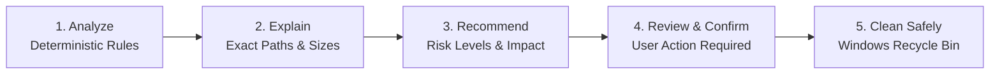

# SpaceOps Safety Model & Deletion Protocol

The foundation of SpaceOps is trust. Because disk management tools interact directly with user data and filesystem structures, SpaceOps adheres to a strict safety-first engineering philosophy:

> **"Analyze first. Explain second. Recommend third. Delete last."**

---

## 1. The Four Safety Pillars

### Pillar 1: The Immutable System Blacklist
The Rust core enforces hardcoded, unbypassable path guards. Any deletion request targeting or resolving into these locations returns a fatal error (`CleanupError::ProtectedPath`):

- Windows OS Directories: `C:\Windows`, `C:\Windows\System32`, `C:\Windows\SysWOW64`
- Program Directories: `C:\Program Files`, `C:\Program Files (x86)`
- System Boot Volumes: `C:\Recovery`, `C:\Boot`, `EFI` system partitions
- System State Files: `pagefile.sys`, `hiberfil.sys`, `swapfile.sys`
- Active User Profiles: `C:\Users\<User>\NTUSER.DAT`, AppData root folders

### Pillar 2: COM Windows Recycle Bin Integration
- SpaceOps **never** performs hard permanent unlinking (`std::fs::remove_file` / `remove_dir_all`) for user cleanups.
- All cleanup requests are dispatched through the Windows Shell COM API (`IFileOperation` / `SHFileOperationW` with `FOF_ALLOWUNDO`).
- Deleted items appear in the Windows Recycle Bin and can be restored at any time.

### Pillar 3: Dry-Run Simulation Mode
- Before any file or folder is touched, SpaceOps supports a `DryRun` simulation pass.
- The engine computes the exact count of candidate files, calculates the aggregated cluster-allocated size, and validates permissions without touching the filesystem.

### Pillar 4: Explicit User Confirmation
- SpaceOps has no automated background deletion timers, no hidden cleanup tasks, and no silent deletions.
- Every action requires interactive review and confirmation from the user in the UI.

---

## 2. Risk Classification Hierarchy

Every cleanup candidate detected by SpaceOps is categorized into one of three standardized risk levels:

| Risk Level | Definition | Examples | Default Selection |
| :--- | :--- | :--- | :--- |
| **Low Risk** | Pure ephemeral cache or crash artifact. Deletion has zero impact on application behavior. | Windows Minidump files (`.dmp`), stale error logs (`.log`), Explorer thumbnail cache. | Selected |
| **Medium Risk** | Re-creatable build artifacts or download caches. Applications may take slightly longer to compile or download on next run. | `node_modules` (with package.json present), Rust `target/`, pip wheel cache, NuGet packages. | User-Selected |
| **High Risk** | Configuration or application state. Removing requires understanding of user intent. | Application orphaned leftover files, Docker container volumes, WSL virtual disks. | Unselected |

---

## 3. Explaining What Happens Before Action

Whenever a candidate item is displayed in the SpaceOps Cleanup or Developer view, the user is presented with three pieces of context:

1. **What is it?** (e.g., *"Cargo build output directory"*).
2. **Where is it?** (e.g., *"D:\Projects\my-app\target"*).
3. **What happens if removed?** (e.g., *"Next build will recompile all dependencies from scratch. Source code and git history are completely untouched."*).
